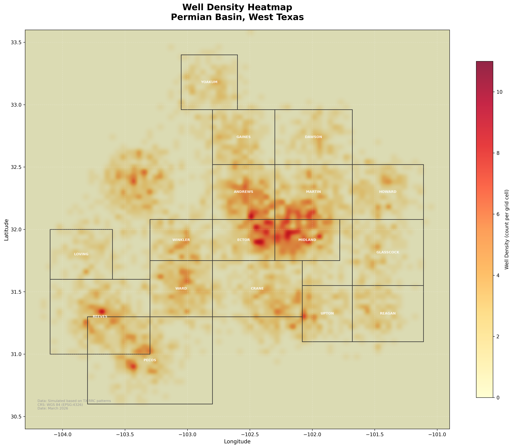
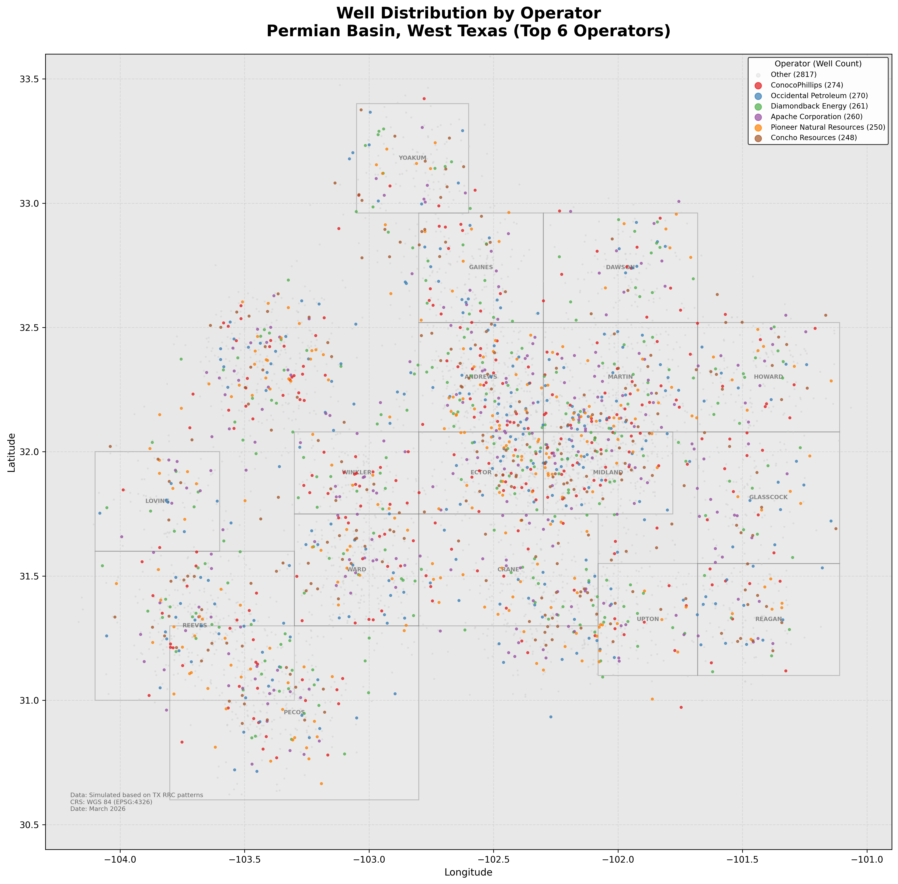
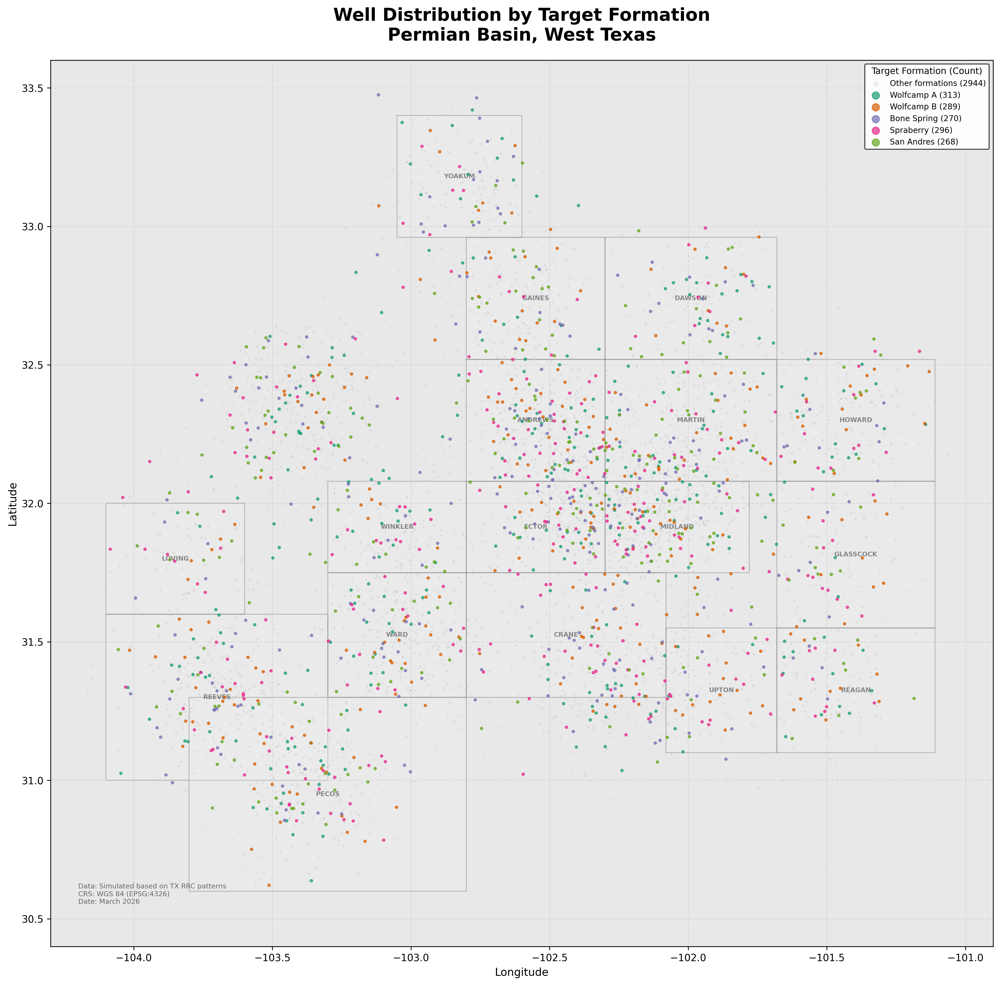

# Project 1: Permian Basin Oil & Gas Well Mapping

## Objective

Map and analyze the spatial distribution of oil and gas wells across the Texas Permian Basin, one of the most prolific hydrocarbon-producing regions in the world. The project classifies wells by type, operator, and target formation to reveal drilling patterns, activity hotspots, and operator footprints.

## Data

| Layer | Records | Format | Description |
|-------|---------|--------|-------------|
| Well Locations | 4,380 | GeoJSON | Point data with 14 attributes per well |
| County Boundaries | 17 | GeoJSON | Permian Basin county polygons |
| Basin Outline | 1 | GeoJSON | Permian Basin extent boundary |

Well attributes include: API number, well name, operator, well type (oil/gas/injection/dry hole/plugged), status, county, coordinates, total depth, target formation, spud date, basin, and elevation.

**Data source:** Simulated dataset modeled on real Permian Basin geographic distributions and Texas Railroad Commission (RRC) data patterns. Real data can be downloaded from the [Texas RRC](https://www.rrc.texas.gov/resource-center/research/data-sets-available-for-download/) or [HIFLD Open Data](https://hifld-geoplatform.opendata.arcgis.com/datasets/oil-and-natural-gas-wells/).

## Maps

### Map 1: Well Distribution by Type
Categorized point symbology classifying each well by production type. Oil wells (green circles), gas wells (red diamonds), oil and gas (orange triangles), injection (blue squares), dry holes (gray crosses), and plugged wells (olive X markers).


### Map 2: Well Density Heatmap
Kernel density visualization highlighting areas of concentrated drilling activity. Midland-Ector county and Reeves County (Delaware Basin) emerge as primary hotspots, consistent with real-world Wolfcamp and Bone Spring development.



### Map 3: Wells by Operator
Spatial footprint of the top 6 operators by well count, showing how operators concentrate activity in specific geographic areas reflecting their leasehold positions.



### Map 4: Wells by Target Formation
Distribution of wells by primary geological target. Wolfcamp, Bone Spring, Spraberry, and San Andres formations dominate, with spatial clustering that reflects subsurface geology of the Midland and Delaware sub-basins.



## How to Reproduce in QGIS

1. Open QGIS 3.x and double-click `Project1_Well_Mapping.qgz` to load the pre-configured project
2. All three layers load with categorized symbology and county labels already applied
3. To modify symbology: right-click a layer > Properties > Symbology
4. To create a Print Layout: Project > New Print Layout, add map frame, legend, scale bar, north arrow
5. Export at 300 DPI via Layout > Export as Image

**Layer styling in the .qgz file:**

| Layer | Renderer | Classification |
|-------|----------|----------------|
| Permian Basin Wells | Categorized | WELL_TYPE field, 6 classes with unique markers |
| County Boundaries | Single symbol | Gray outline, beige fill, bold NAME labels |
| Basin Outline | Single symbol | Dashed brown border, 15% opacity fill |

## GIS Skills Demonstrated

- Loading and managing vector data (GeoJSON, CSV with coordinates)
- Categorized symbology with custom marker shapes and color schemes
- Heatmap/density analysis for spatial pattern identification
- Multi-attribute spatial analysis (type, operator, formation)
- Cartographic composition with legend, scale bar, north arrow, attribution
- CRS management (WGS 84 / EPSG:4326)
- QGIS Print Layout for publication-quality export

## File Structure

```
Project1_Well_Mapping/
  Project1_Well_Mapping.qgz          QGIS 3.38 project (pre-styled)
  data/
    wells/
      permian_basin_wells.geojson     4,380 well points, 14 attributes
    boundaries/
      permian_basin_counties.geojson  17 county polygons
      permian_basin_outline.geojson   Basin extent polygon
  maps/
    Map1_Well_Distribution_By_Type.png
    Map2_Well_Density_Heatmap.png
    Map3_Wells_By_Operator.png
    Map4_Wells_By_Formation.png
```
