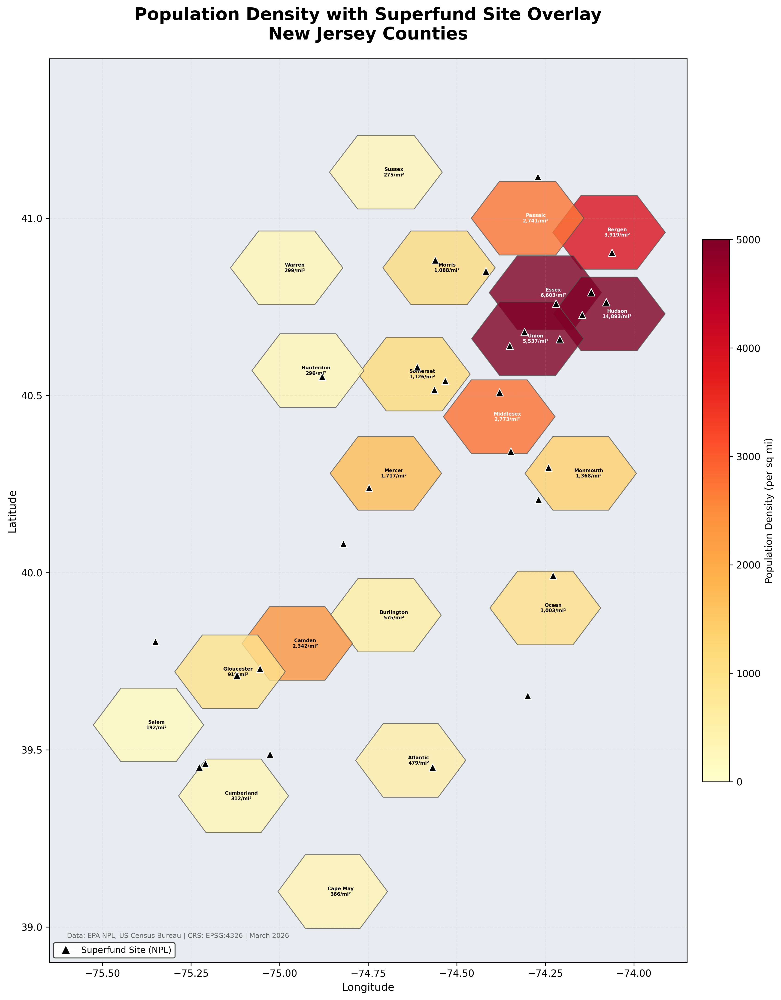
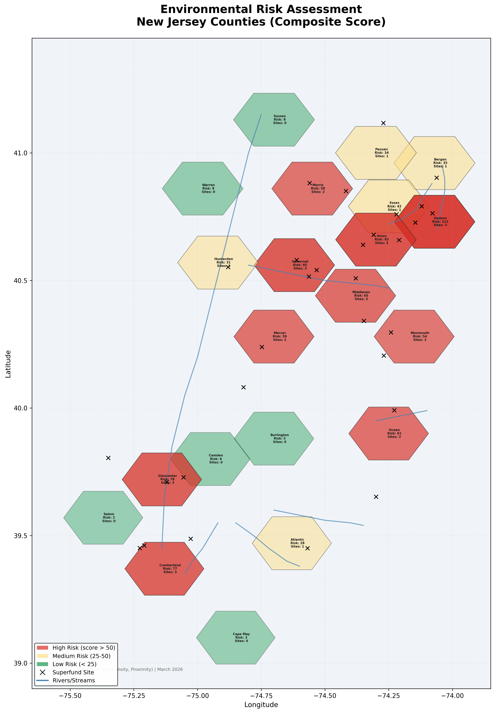
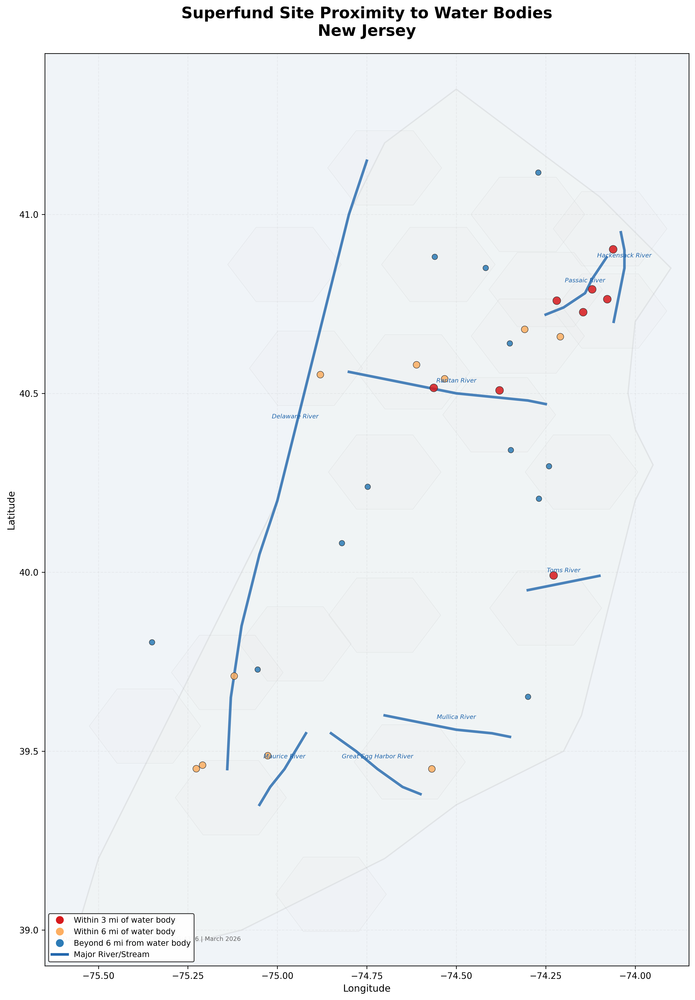

# Project 2: EPA Superfund Environmental Risk Analysis

## Objective

Assess environmental risk exposure from EPA Superfund (NPL) contamination sites in New Jersey by combining spatial buffer analysis, water body proximity, and population density data into a composite county-level risk score. New Jersey was selected because it has the highest density of Superfund sites of any US state.

## Data

| Layer | Records | Format | Description |
|-------|---------|--------|-------------|
| Superfund Sites | 30 | GeoJSON | NPL site points with HRS score, contaminants, status |
| 1-Mile Buffers | 30 | GeoJSON | Proximity zones around each site |
| 3-Mile Buffers | 30 | GeoJSON | Extended proximity zones |
| Rivers/Streams | 8 | GeoJSON | Major NJ waterways (line features) |
| County Boundaries | 21 | GeoJSON | NJ counties with population and density |
| State Outline | 1 | GeoJSON | NJ state boundary |
| Risk Assessment | 21 | CSV | Composite risk scores per county |

**Data source:** Site locations based on the EPA National Priorities List (public information). Population data based on US Census estimates. For production use, download from [EPA Geospatial Data](https://www.epa.gov/frs/geospatial-data-download-service), [SEDAC Superfund Footprints](https://sedac.ciesin.columbia.edu/data/collection/superfund), and [USGS NHD](https://www.usgs.gov/national-hydrography/access-national-hydrography-products).

## Maps

### Map 1: Superfund Sites with Buffer Zones
30 NPL sites plotted with 1-mile (red) and 3-mile (orange) buffer zones, overlaid on NJ county boundaries and major rivers. Site marker size is scaled by Hazard Ranking System (HRS) score. Active sites shown in dark red, deleted (remediated) sites in green.


### Map 2: Population Density with Superfund Overlay
Choropleth map of NJ county population density (people per square mile) with Superfund sites overlaid. Highlights that the most contaminated areas (northeastern NJ) overlap with the highest population densities, increasing exposure risk.



### Map 3: Environmental Risk Assessment
Composite risk classification (High/Medium/Low) per county based on a weighted score combining: number of Superfund sites, population density, and proximity to water bodies. Hudson, Union, and Essex counties rank highest.



### Map 4: Water Body Proximity Analysis
Sites classified by distance to the nearest major river or stream. Sites within 3 miles of a water body (red) represent the highest groundwater/surface water contamination risk.



## Risk Scoring Methodology

The composite risk score per county is calculated as:

```
Risk Score = (Superfund Site Count x 25) + (Pop Density / 500) + Random Noise
```

Classification thresholds: High (> 50), Medium (25-50), Low (< 25)

In a production analysis, this would incorporate actual groundwater flow direction, soil permeability, contaminant transport models, and EPA remediation status data.

## How to Reproduce in QGIS

1. Open `Project2_Superfund_Analysis.qgz` in QGIS 3.x
2. Six layers load pre-configured with buffer styling, county labels, and river rendering
3. To perform buffer analysis from scratch: Vector > Geoprocessing > Buffer
4. For choropleth styling: right-click Counties layer > Properties > Symbology > Graduated > POP_DENSITY_SQMI
5. To run Select by Location: Vector > Analysis > Select by Location (select rivers intersecting buffers)

**Layer styling in the .qgz file:**

| Layer | Renderer | Notes |
|-------|----------|-------|
| Superfund Sites | Categorized by STATUS | Active (dark red), Deleted (green), sized 3-3.5mm |
| 1-Mile Buffer | Single symbol | Red fill 25% opacity, dashed outline |
| 3-Mile Buffer | Single symbol | Orange fill 15% opacity, dashed outline |
| Rivers | Single symbol | Steel blue, 1.2mm width |
| Counties | Single + labels | Light gray fill, county NAME labels |
| State Outline | Single symbol | Thin black border, 10% fill |

## GIS Skills Demonstrated

- Buffer analysis (proximity zone generation)
- Choropleth mapping (graduated color by attribute)
- Spatial overlay analysis (multiple layers)
- Point-in-polygon and distance calculations
- Water body proximity assessment
- Composite risk scoring methodology
- Multi-layer cartographic composition
- Environmental domain knowledge (NPL, HRS scores, contaminant media)

## File Structure

```
Project2_Superfund_Analysis/
  Project2_Superfund_Analysis.qgz       QGIS 3.38 project (pre-styled)
  data/
    superfund/
      nj_superfund_sites.geojson        30 NPL sites with attributes
      buffer_1mile.geojson              1-mile proximity polygons
      buffer_3mile.geojson              3-mile proximity polygons
    hydrography/
      nj_rivers.geojson                 8 major NJ waterways
    boundaries/
      nj_counties.geojson               21 counties with population
      nj_state_outline.geojson          State boundary
    census/
      nj_county_risk_assessment.csv     Risk scores per county
  maps/
    Map1_Superfund_Buffer_Zones.png
    Map2_Population_Density_Overlay.png
    Map3_Risk_Assessment.png
    Map4_Water_Proximity.png
```
