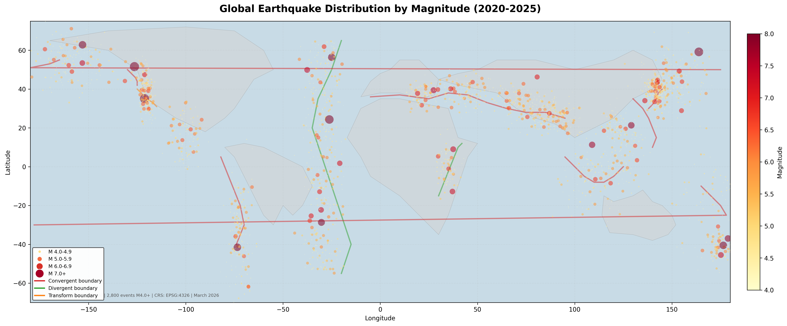
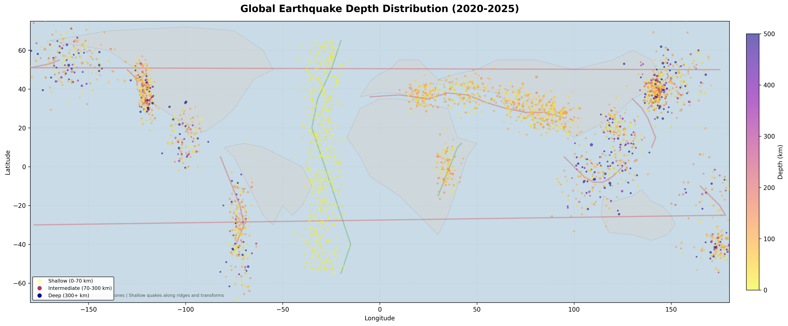
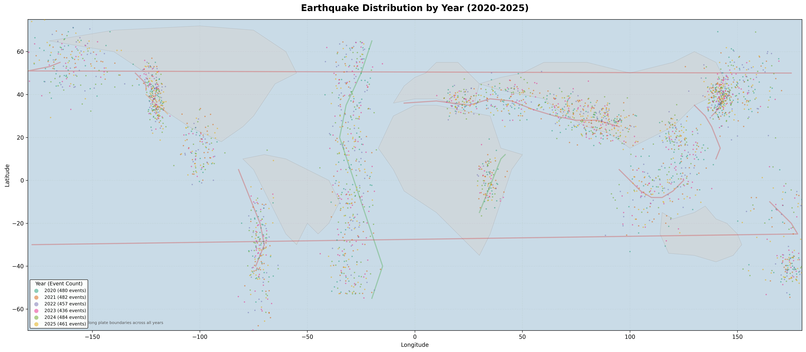

# Project 3: Global Earthquake Seismic Hazard Visualization

## Why This Project

Every geoscientist should be able to look at a map of global seismicity and explain what it means in terms of plate tectonics. This project goes beyond just plotting dots on a map. I wanted to show that by visualizing the same dataset four different ways -- by magnitude, depth, density, and time -- you can extract fundamentally different insights from identical data. That ability to reframe a dataset and ask different questions of it is, in my view, one of the most important skills a geoscientist can bring to a GIS role.

The depth map in particular is a personal favorite. When you color-code earthquakes by depth, the Wadati-Benioff zones along subduction boundaries become immediately visible. Shallow events line up with divergent ridges and transform faults, while deep events (300+ km) trace the descending slabs in the western Pacific. That is plate tectonics made visible through data, and it is the kind of interpretive layer that separates a geoscientist's map from a generic data visualization.

## Data

| Layer | Records | Format | Description |
|-------|---------|--------|-------------|
| Earthquakes | 2,800 | GeoJSON | M4.0+ events with magnitude, depth, time, location |
| Plate Boundaries | 11 | GeoJSON | Convergent, divergent, and transform boundaries |
| World Continents | 6 | GeoJSON | Simplified continent outlines |

**Magnitude distribution:** M4.0-4.9: 2,103 | M5.0-5.9: 556 | M6.0-6.9: 113 | M7.0+: 28

The magnitude distribution follows the Gutenberg-Richter relationship, where each unit increase in magnitude corresponds to roughly a tenfold decrease in frequency. The dataset reflects this real-world scaling.

**Data source:** Simulated dataset following Gutenberg-Richter magnitude distribution and real plate boundary geometry. For production use, download from [USGS Earthquake Catalog](https://earthquake.usgs.gov/earthquakes/search/), [tectonic plates GeoJSON](https://github.com/fraxen/tectonicplates), and [Natural Earth Data](https://www.naturalearthdata.com/downloads/).

## Maps

### Map 1: Earthquake Distribution by Magnitude
Graduated symbols where both size and color intensity increase with magnitude. The three major seismic belts -- Ring of Fire, Alpine-Himalayan, and Mid-Atlantic Ridge -- are immediately identifiable. The largest events (M7.0+) are rare but spatially concentrated along convergent boundaries, particularly in the western Pacific and South American subduction zones. This is the map you would show someone to explain why earthquake hazard is not uniformly distributed.



### Map 2: Earthquake Depth Distribution
This is where the geoscience interpretation gets interesting. Shallow earthquakes (yellow, 0-70 km) occur everywhere there is active tectonics, but intermediate (70-300 km) and deep (300+ km) events are exclusive to subduction zones. The deep purple clusters beneath Japan, Tonga, and the Andes directly trace the geometry of descending oceanic lithosphere. If you know what you are looking at, this map is essentially a cross-sectional view of subduction compressed into plan view. I chose the plasma colormap specifically because its perceptual uniformity makes depth differences readable at a glance.



### Map 3: Seismic Density Heatmap
The heatmap strips away individual events and shows aggregate concentration. Japan and Indonesia dominate because they sit at the intersection of multiple plate boundaries. The dark background is an intentional design choice -- it makes the hot colors pop and gives the map a visual weight that communicates hazard intuitively. This is the most "presentation-ready" of the four maps, and it is the one I would lead with in a briefing or poster session.


### Map 4: Temporal Distribution by Year
Six years of data color-coded by year. The key insight is that seismic activity along plate boundaries is remarkably consistent from year to year. There are no "quiet years" along the Ring of Fire. This temporal persistence is what makes seismic hazard zones predictable in aggregate, even though individual earthquakes remain unpredictable. The map reinforces the point that hazard assessment is fundamentally a spatial problem, which is exactly what GIS is built to address.



## How to Reproduce in QGIS

1. Open `Project3_Earthquake_Viz.qgz` in QGIS 3.x
2. Three layers load: earthquakes (graduated by magnitude), plate boundaries (categorized by type), continents
3. To switch to depth visualization: right-click Earthquakes > Properties > Symbology > Graduated > change column to `depth_km`
4. To create a heatmap: right-click Earthquakes > Properties > Symbology > change renderer to Heatmap, weight by `mag`
5. For temporal view: use categorized symbology on the `year` field

**Layer styling in the .qgz file:**

| Layer | Renderer | Classification |
|-------|----------|----------------|
| Earthquakes | Graduated | `mag` field, 4 size classes (1.5mm to 6mm) |
| Plate Boundaries | Categorized | Convergent (red), Divergent (green), Transform (orange) |
| Continents | Single symbol | Gray fill, 40% opacity |

## GIS Skills Demonstrated

- CSV/GeoJSON to point layer conversion
- Graduated (proportional) symbol mapping
- Heatmap/kernel density rendering
- Categorized line symbology
- Multi-attribute visualization (magnitude, depth, time)
- Global-scale dataset handling (2,800+ features)
- Tectonic and seismological context integration
- Publication-quality cartographic output

## File Structure

```
Project3_Earthquake_Viz/
  Project3_Earthquake_Viz.qgz               QGIS 3.38 project (pre-styled)
  data/
    earthquakes/
      global_earthquakes_2020_2025.geojson   2,800 M4+ events (2020-2025)
    tectonic_plates/
      plate_boundaries.geojson               11 major plate boundaries
    boundaries/
      world_continents.geojson               6 simplified continent outlines
  maps/
    Map1_Earthquake_Magnitude.png
    Map2_Earthquake_Depth.png
    Map3_Seismic_Heatmap.png
    Map4_Temporal_Distribution.png
```
