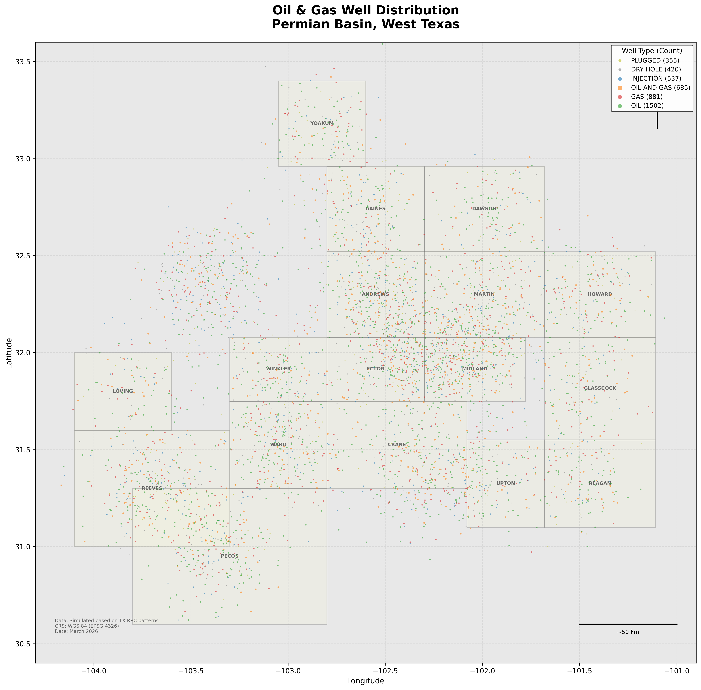
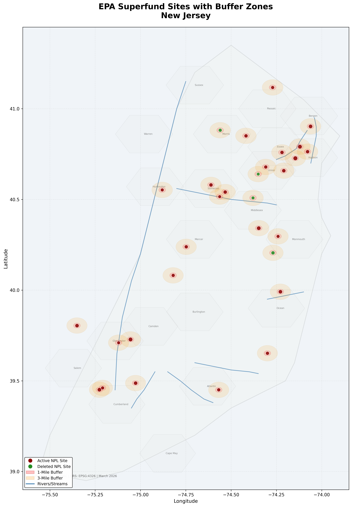
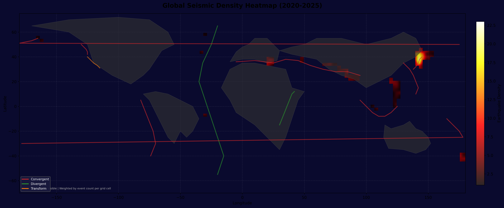

# QGIS Geoscience & Environmental Portfolio

GIS projects demonstrating spatial analysis across oil and gas, environmental science, and geohazard domains. Built with QGIS 3.38 and Python, using publicly available datasets.

## Projects

### [Project 1: Permian Basin Well Mapping](Project1_Well_Mapping/)

Categorized mapping and spatial analysis of 4,380 oil and gas wells across the Texas Permian Basin. Wells are classified by type, operator, and target formation, with density analysis to identify drilling hotspots.

**GIS techniques:** Categorized/graduated symbology, heatmap rendering, attribute-based filtering, CSV-to-point conversion, Print Layout composition

---

### [Project 2: EPA Superfund Environmental Risk Analysis](Project2_Superfund_Analysis/)

Spatial risk assessment of 30 EPA Superfund (NPL) contamination sites in New Jersey using buffer analysis, water body proximity, and population density to produce a composite county-level risk score.

**GIS techniques:** Buffer/proximity analysis, choropleth mapping, spatial overlay, point-in-polygon, composite risk scoring, multi-layer cartographic composition

---

### [Project 3: Global Earthquake Seismic Hazard Visualization](Project3_Earthquake_Viz/)

Global seismic activity visualization (2020-2025) showing 2,800 M4.0+ earthquakes with magnitude, depth, and density analysis overlaid on tectonic plate boundaries. The Ring of Fire, Alpine-Himalayan Belt, and Mid-Atlantic Ridge emerge clearly from the data.

**GIS techniques:** Graduated/proportional symbols, heatmap density, depth classification, temporal visualization, global-scale data handling

## Tools

- QGIS 3.38 (spatial analysis and cartographic output)
- Python 3 with matplotlib (data processing and visualization)
- Data formats: GeoJSON, CSV, Shapefile

## Author

**Israel Aina**
Production Geologist | Technical Data Management | Geospatial Analysis

## License

MIT License. Data files are subject to their respective source licenses.
